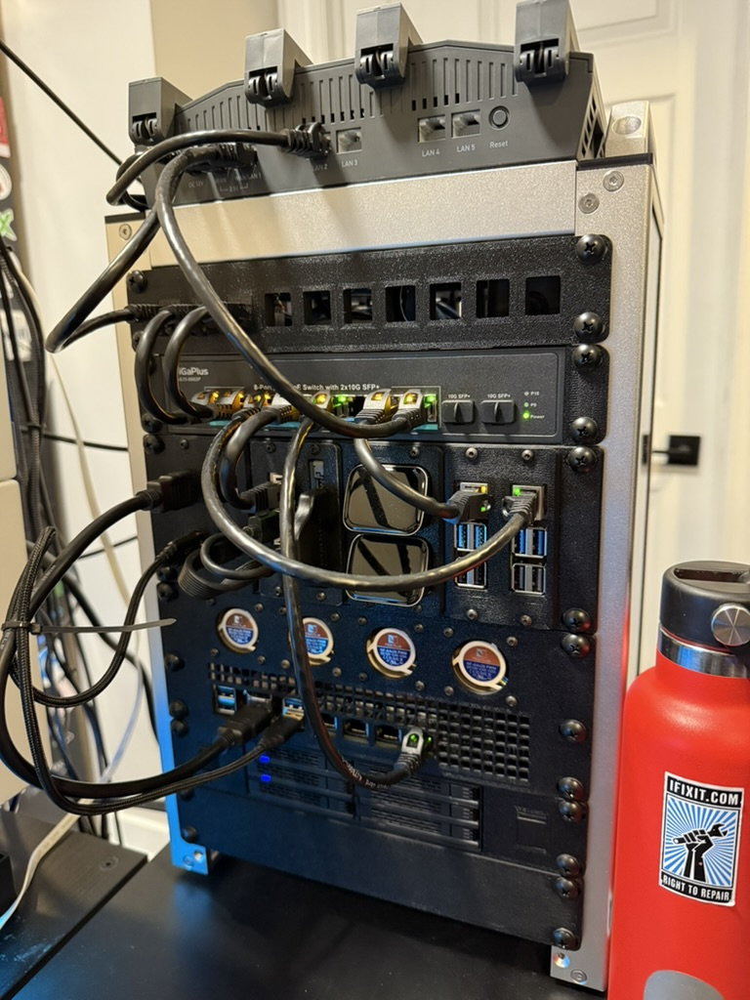
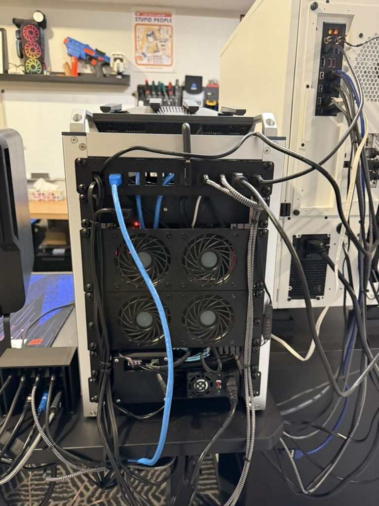
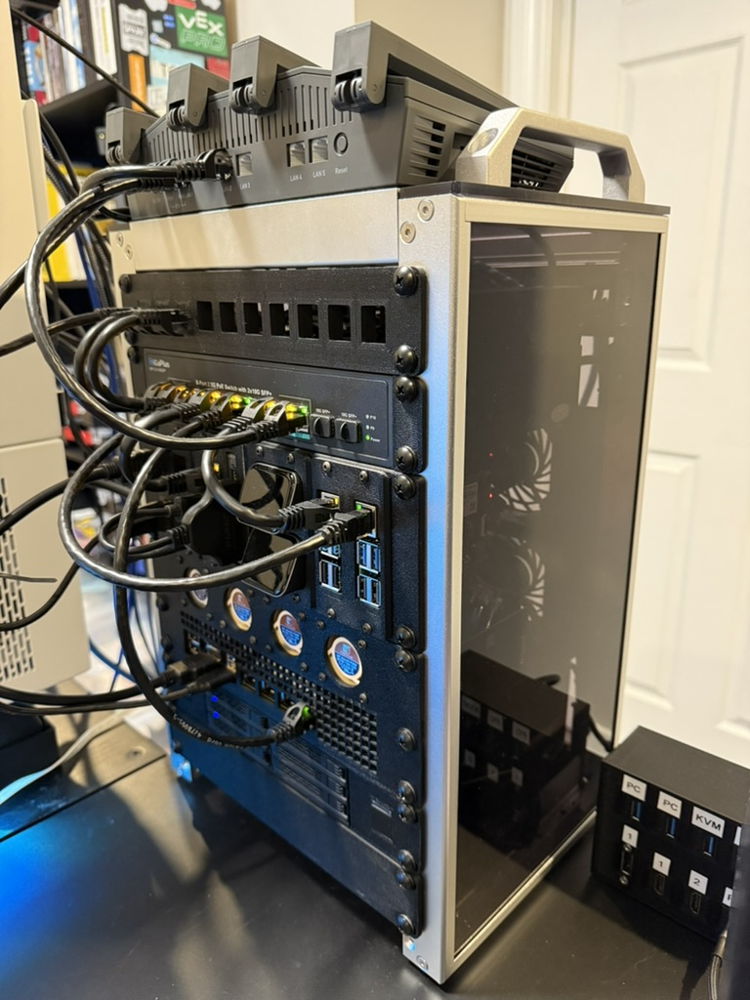
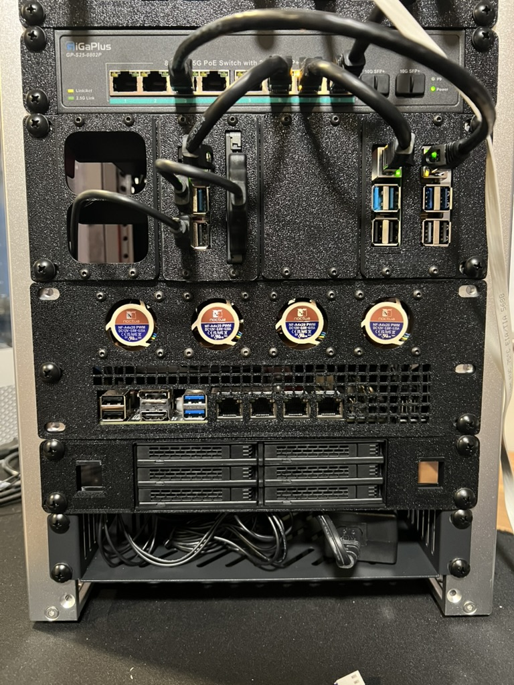
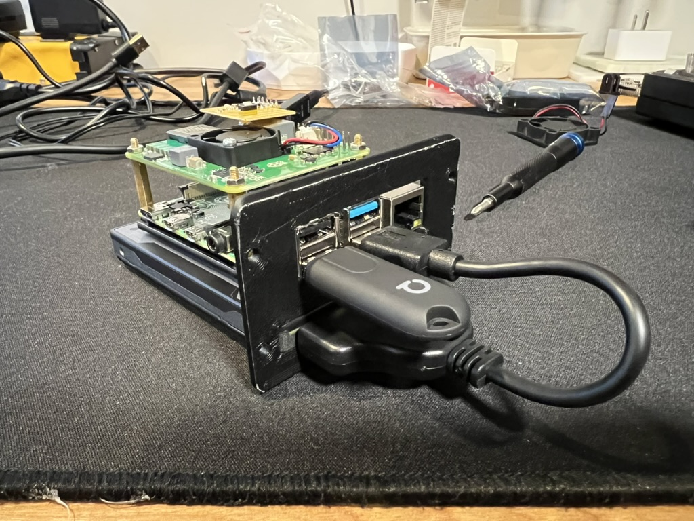
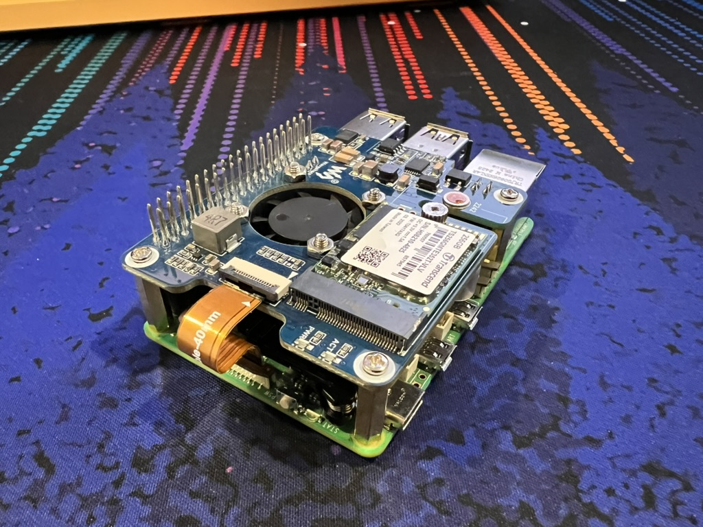
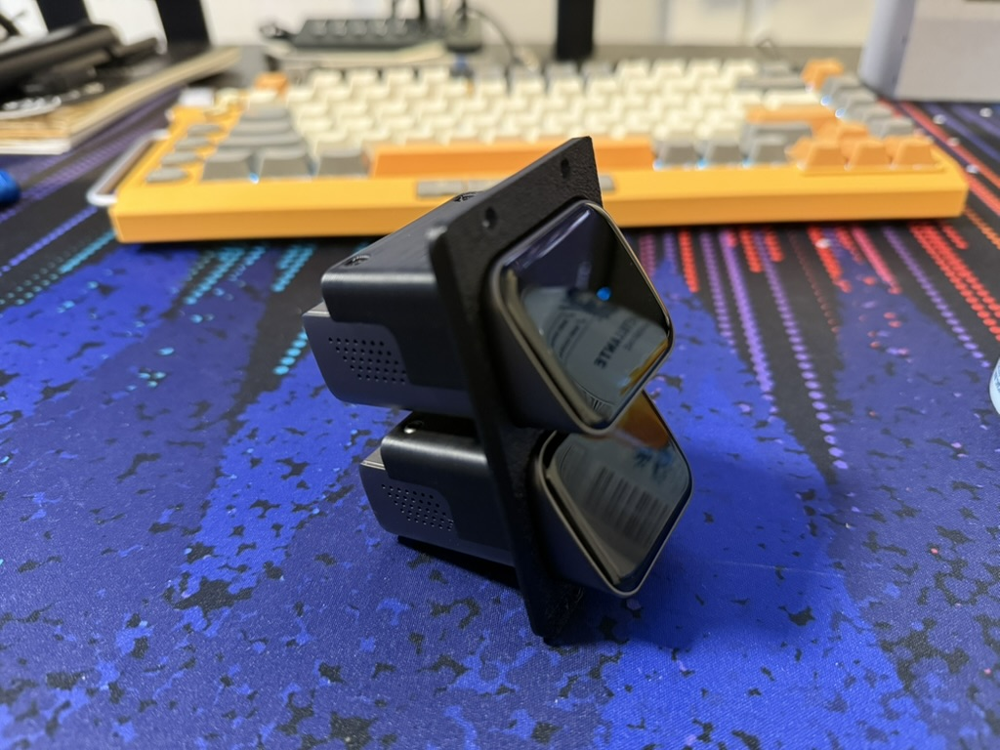
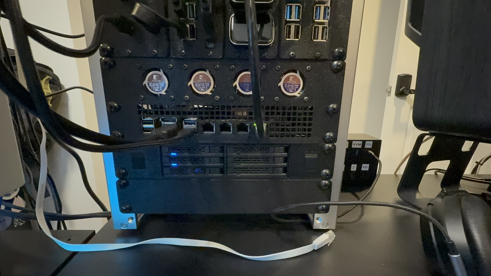
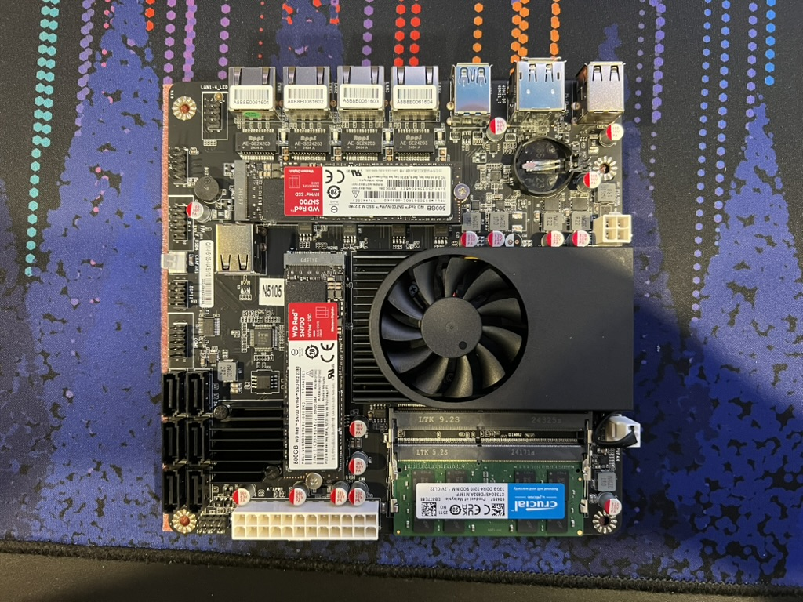

# Ratrack

A self-hosted mini-rack homelab built around the 10-inch rack standard. It houses a router, PoE switch, Home Assistant, Pi-hole, Docker host, Proxmox NAS, and IP KVMs — all on a desk.

Inspired by Jeff Geerling's [mini-rack](https://github.com/geerlingguy/mini-rack) project.

## Gallery

| Front | Rear | Side |
|-------|------|------|
|  |  |  |

Front (no wires) | Home Assistant stack | Pi 5 stack | JetKVM stack |
|-----------------|----------------------|-------------|--------------|
|  |  |  |  |

Proxmox NAS (front I/O) | Proxmox motherboard |
|------------------------|---------------------|
|  |  |

## Rack Layout (8U)

| Position | Device | Role |
|----------|--------|------|
| 1U | GL.iNet Flint 2 | Router (Wi-Fi 6, WireGuard, OpenWrt) |
| 1U | GigaPlus GP-S25-0802P | 10-port 2.5 GbE PoE switch |
| 1U | 10-port keystone patch panel | Network patch panel |
| 1U | Raspberry Pi 4 (4 GB) | Home Assistant (SSD, PoE HAT, Z-Wave, Zigbee) |
| — | Raspberry Pi 4 (1 GB) | Pi-hole / DNS (DietPi, PoE HAT, Tailscale) |
| — | Raspberry Pi 5 | Docker host (NVMe SSD, PoE HAT) |
| 2U | N100 mini-ITX + ICY DOCK 6-bay | Proxmox NAS (SnapRAID, MergerFS, Samba) |
| — | 2 × JetKVM | IP KVM for main PC and NAS |

## Cooling

- **Rear:** 4 × 80 mm Noctua Redux fans (intake)
- **Front:** 4 × 40 mm Noctua fans (exhaust)
- **Control:** ESP32 running ESPHome with an AHT10 temperature sensor, connected to Home Assistant. Fan speed follows a temperature-based curve defined in [`homeassistant/esphome-controller.yaml`](homeassistant/esphome-controller.yaml).

## Home Assistant Dashboard

The Lovelace dashboard in [`homeassistant/dashboard.yaml`](homeassistant/dashboard.yaml) provides a single-page overview of the rack. It is built with Mushroom, Button Card, and other HACS custom cards.

Requires HACS frontend components: `button-card`, `mushroom`, `tabbed-card`, `auto-entities`, `layout-card`, `card-mod`, and the `pi-hole` card.

## Repo Structure

```
ratrack/
├── images/                 # Photos of the rack
├── homeassistant/          # Home Assistant and ESPHome configs
│   ├── dashboard.yaml            # HA Lovelace dashboard for the rack
│   └── esphome-controller.yaml   # ESP32 fan controller (fan curve + sensors)
├── docker/                 # Docker Compose files for the Pi 5
│   └── docker-compose.yml        # n8n, Portainer, Homer, etc.
├── proxmox/                # Proxmox NAS configuration
│   ├── snapraid.conf             # SnapRAID config
│   ├── mergerfs.fstab            # MergerFS mount entries
│   ├── smb.conf                  # Samba shares
│   ├── crontab                   # SnapRAID sync/scrub cron jobs
│   └── README.md                 # Full NAS setup walkthrough
└── README.md
```

## Hardware

### Compute

| Component | Specs | Use |
|-----------|-------|-----|
| GL.iNet Flint 2 | Wi-Fi 6, 2.5 GbE WAN/LAN, OpenWrt | Router, WireGuard VPN |
| GigaPlus GP-S25-0802P | 8 × 2.5 GbE PoE + 2 × 10G SFP+ | PoE switch |
| Raspberry Pi 4 (4 GB) | SSD, PoE HAT, Z-Wave, Zigbee | Home Assistant |
| Raspberry Pi 4 (1 GB) | microSD, PoE HAT, DietPi | Pi-hole, Tailscale DNS |
| Raspberry Pi 5 | NVMe SSD, PoE HAT | Docker (n8n, Portainer, Homer) |
| N100 mini-ITX | 4 × Ethernet, 2 × NVMe, 6 × SATA | Proxmox NAS |
| 2 × JetKVM | USB/HDMI over IP | Remote KVM for PC and NAS |

### Storage (NAS)

| Slot | Drive | Role |
|------|-------|------|
| NVMe 1 | WD Red SSD | Proxmox OS |
| NVMe 2 | WD Red SSD | High-speed project files |
| ICY DOCK Bay 1 | SATA SSD | General / admin files |
| ICY DOCK Bay 2 | SATA SSD | SnapRAID parity |
| ICY DOCK Bay 3–6 | — | Available for expansion |

Drives are pooled with **MergerFS** and protected by **SnapRAID**. Off-site backup runs daily to **Backblaze B2**. **Gitea** mirrors GitHub repos to the NAS.

### Cooling

| Component | Qty | Location |
|-----------|-----|----------|
| Noctua Redux 80 mm | 4 | Rear (intake) |
| Noctua 40 mm | 4 | Front (exhaust) |
| ESP32 (ESPHome) | 1 | Fan controller + AHT10 temp sensor |

## 3D Prints and Resources

The rack uses a mix of 3D-printed faceplates, mounting brackets, and shelves. Metal 1U shelves are used for heavier or hotter components.

| Print / Resource | Source |
|------------------|--------|
| **DeskPi RackMate T1** (8U frame) | [DeskPi Store](https://deskpi.com/products/deskpi-rackmate-t1-2) |
| **LabStack** modular SBC/accessory mounts | [JaredC01/LabStack](https://github.com/JaredC01/LabStack/tree/main) |
| GigaPlus GP-S25-0802P rack ears (monkizzle) | [mini-rack #76](https://github.com/geerlingguy/mini-rack/issues/76) |
| GigaPlus switch mounting ears (r3vo) | [Printables](https://www.printables.com/model/1215585-unified-10-rack-gigaplus-switch-mounting-ears/files) |
| 10-inch keystone patch panel (10 port) | [Printables](https://www.printables.com/model/1088263-10-inch-keystone-patchpanel-x10-ports) |
| MiniRax 1U vented blank panel | [MakerWorld](https://makerworld.com/en/models/1049662-minirax-1u-vented-blank#profileId-1036184) |
| 10-inch mini rack parts (Raid Owl) | [Printables](https://www.printables.com/model/1282539-10-inch-mini-rack/files) |
| Cable tie / Velcro anchors | [MakerWorld](https://makerworld.com/en/models/1121115-server-cable-tie-velcro-anchor#profileId-1119549) |

## Software Stack

| Service | Runs On | Purpose |
|---------|---------|---------|
| **Home Assistant** | Pi 4 (4 GB) | Home automation, ESPHome fan control |
| **Pi-hole** | Pi 4 (1 GB) | Network-wide ad blocking |
| **Tailscale** | Pi-hole Pi | Mesh VPN, DNS exit node |
| **Proxmox VE** | N100 ITX | Hypervisor / NAS OS |
| **SnapRAID** | Proxmox | Parity-based data protection |
| **MergerFS** | Proxmox | Drive pooling |
| **Samba** | Proxmox | Network file shares |
| **Backblaze B2** | Proxmox | Daily off-site backup |
| **Gitea** | Proxmox | Git mirror from GitHub |
| **n8n** | Pi 5 | Workflow automation |
| **Portainer** | Pi 5 | Docker management UI |
| **Homer** | Pi 5 | Dashboard |
| **ESPHome** | ESP32 | Fan curve controller |
| **WireGuard** | Flint 2 | VPN |

## Acknowledgments

- [Jeff Geerling / mini-rack](https://github.com/geerlingguy/mini-rack) for the inspiration and the community hardware catalogue.
- [JaredC01 / LabStack](https://github.com/JaredC01/LabStack) for the modular SBC mounting system.
- [monkizzle](https://github.com/geerlingguy/mini-rack/issues/76), [r3vo](https://www.printables.com/model/1215585), [Mauker](https://www.printables.com/model/1088263), [Raid Owl](https://www.printables.com/model/1282539) and others whose 3D designs made this build possible.

## License

MIT
